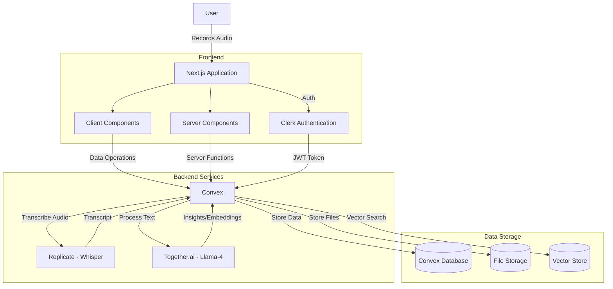
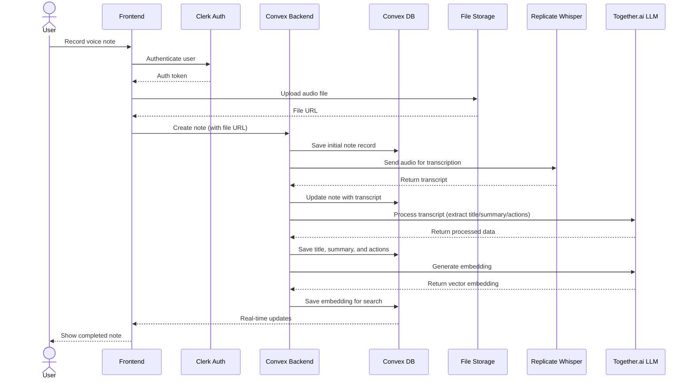
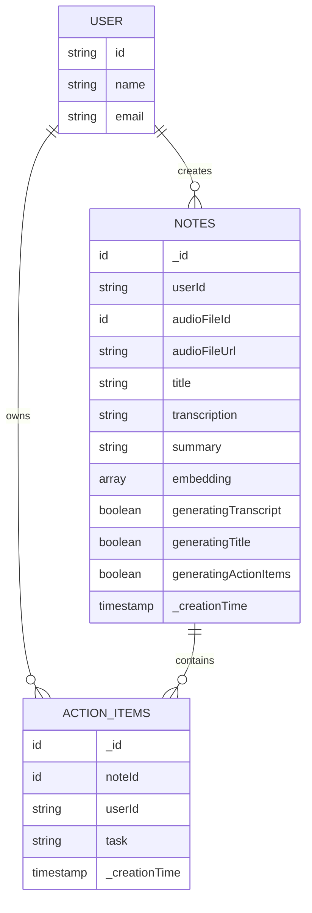
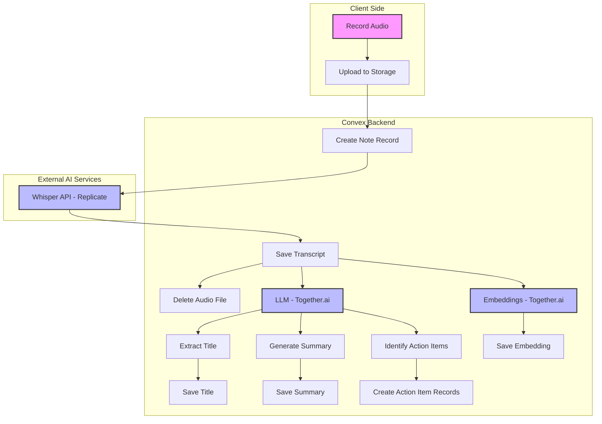
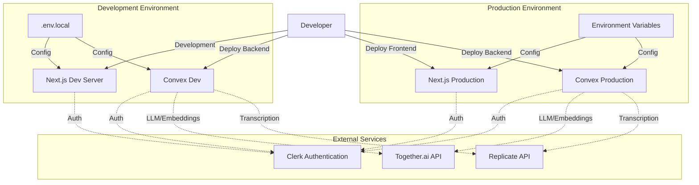
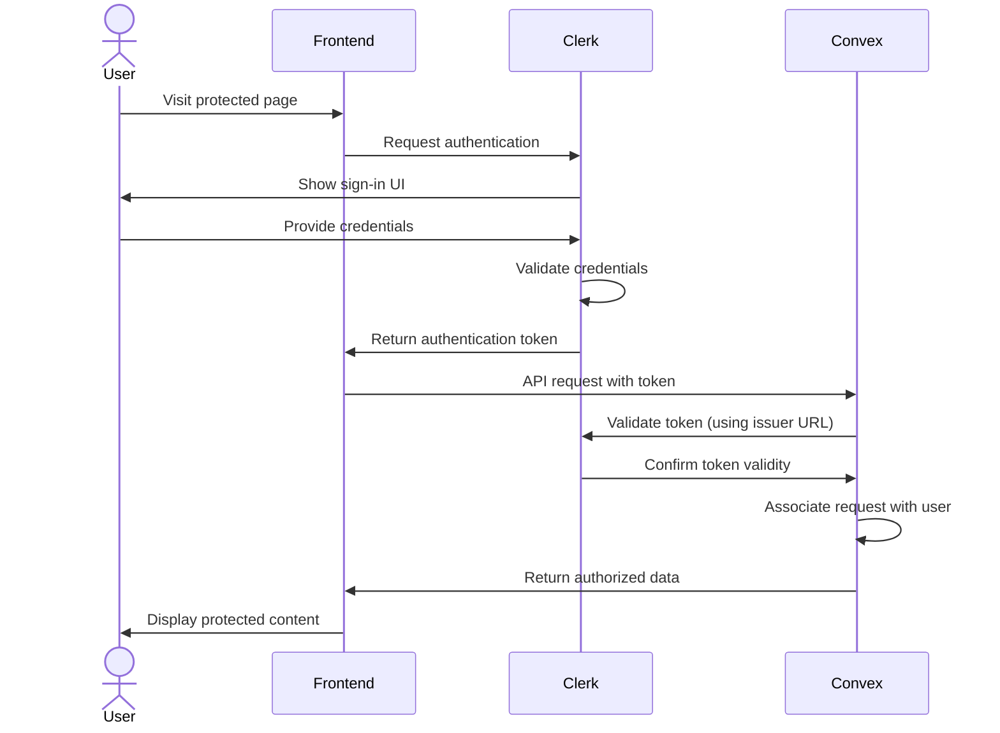

# Architecture Diagrams

## System Architecture Diagram



## Data Flow Diagram



## Component Architecture

```mermaid
componentDiagram
    component Frontend {
        component Pages {
            component LandingPage
            component DashboardPage
            component RecordPage
            component RecordingViewPage
            component ActionItemsPage
        }
        
        component Components {
            component UI {
                component Header
                component Footer
                component Button
                component UserNav
            }
            component Feature {
                component RecordingComponent
                component NoteCard
                component ActionItemList
                component SearchBar
            }
        }
        
        component Providers {
            component ConvexProvider
            component ClerkProvider
        }
    }
    
    component Backend {
        component ConvexFunctions {
            component NotesFunctions
            component WhisperFunctions
            component TogetherFunctions
            component UtilFunctions
        }
        
        component Database {
            component NotesTable
            component ActionItemsTable
            component VectorIndex
        }
    }
    
    component ExternalServices {
        component ClerkAuth
        component ReplicateAPI
        component TogetherAI
    }
    
    Providers --> ExternalServices
    Pages --> Components
    Frontend --> Backend
    ConvexFunctions --> Database
    ConvexFunctions --> ExternalServices
```

## Database Schema Diagram



## Processing Pipeline



## Deployment Architecture



## Authentication Flow


