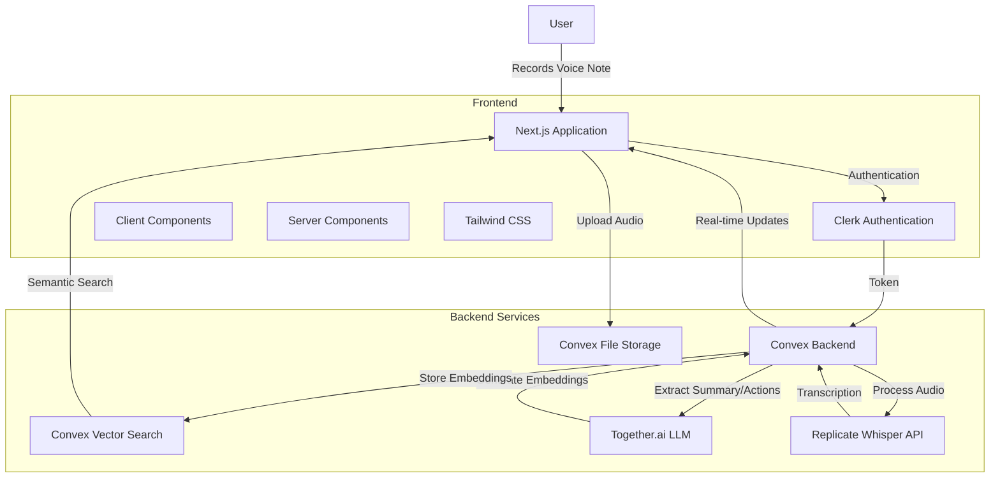

# AgenticNotes Architecture Overview

## System Architecture

The AgenticNotes application is built using a modern web stack that combines several powerful technologies to provide a seamless voice note-taking experience. The application follows a client-server architecture with clear separation of concerns:

### Frontend
- **Next.js (v14.0.4)**: React framework using App Router for routing and rendering
- **React**: Component-based UI library
- **TailwindCSS**: Utility-first CSS framework for styling
- **Clerk**: Authentication and user management

### Backend
- **Convex**: Backend-as-a-service platform for database, file storage, functions, and real-time updates
- **Replicate**: AI service for audio transcription via Whisper model
- **Together.ai**: AI service for LLM-based text analysis and embedding generation

## Architecture Diagram

## Data Flow

1. **Authentication Flow**:
   - User authenticates using Clerk
   - Authentication token is sent to Convex backend
   - Convex backend validates token using Clerk JWT

2. **Voice Note Recording Flow**:
   - User records audio in the browser
   - Audio is uploaded to Convex file storage
   - A new note record is created in the database
   - The note ID is sent to the client

3. **Processing Flow**:
   - Audio file URL is sent to Replicate's Whisper API
   - Transcription is saved to the note record
   - Transcript is sent to Together.ai for analysis
   - Together.ai extracts title, summary, action items
   - Text embedding is generated for search
   - All data is saved to the note record

4. **Retrieval Flow**:
   - User can view all their notes
   - User can search notes semantically using vector search
   - User can view and manage action items

## Technical Constraints

1. **Replicate API Requirements**:
   - Requires a paid account with billing information
   - Uses Whisper large-v3 model for transcription

2. **Together.ai Requirements**:
   - Requires API key
   - Uses meta-llama/Llama-4-Scout-17B-16E-Instruct for LLM processing

3. **Convex Deployment**:
   - Requires Node.js v18.17.0 for CLI deployment
   - Newer Node.js versions (v23+) cause "spawn EINVAL" errors

4. **Environment Variables**:
   - Multiple environment variables must be set in both local .env.local and Convex dashboard
   - CLERK_ISSUER_URL, TOGETHER_API_KEY, and REPLICATE_API_KEY are critical
