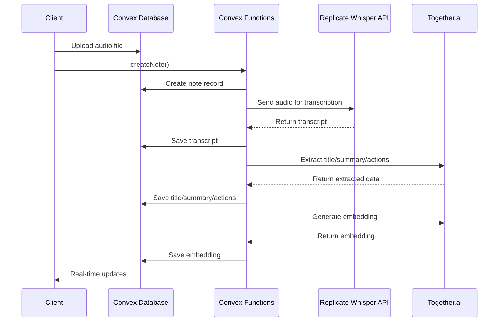

# Backend Functions Documentation

## Overview

The AgenticNotes application uses Convex for backend functions. These functions are organized into several modules that handle different aspects of the application, including note management, audio processing, and AI integration.

## Function Modules

### `notes.ts`

Manages note creation, retrieval, and management.

#### Functions

| Function | Type | Description |
|----------|------|-------------|
| `generateUploadUrl` | Mutation | Generates a URL for uploading audio files to Convex storage |
| `createNote` | Mutation | Creates a new note and initiates the processing pipeline |
| `getNote` | Query | Retrieves a single note with its action items |
| `getActionItems` | Query | Retrieves all action items for the current user |
| `getNotes` | Query | Retrieves all notes for the current user |
| `removeActionItem` | Mutation | Deletes an action item |
| `removeNote` | Mutation | Deletes a note |
| `actionItemCountForNote` | Query | Counts the number of action items for a specific note |
| `deleteOldFiles` | Internal Mutation | Deletes old files from storage for cleanup |

### `whisper.ts`

Handles audio transcription using Replicate's Whisper API.

#### Functions

| Function | Type | Description |
|----------|------|-------------|
| `chat` | Internal Action | Sends audio to Whisper API for transcription |
| `saveTranscript` | Internal Mutation | Saves the transcript to the note and triggers the next processing steps |

### `together.ts`

Handles interaction with Together.ai for LLM processing and embeddings.

#### Functions

| Function | Type | Description |
|----------|------|-------------|
| `chat` | Internal Action | Extracts title, summary, and action items from transcript |
| `getTranscript` | Internal Query | Retrieves the transcript for a note |
| `saveSummary` | Internal Mutation | Saves the generated summary, title, and action items |
| `similarNotes` | Action | Searches for semantically similar notes |
| `embed` | Internal Action | Generates embeddings for vector search |
| `saveEmbedding` | Internal Mutation | Saves the generated embedding to the note |

### `utils.ts`

Utility functions for authentication and function wrappers.

#### Functions

| Function | Type | Description |
|----------|------|-------------|
| `queryWithUser` | Function | Wraps queries with user authentication |
| `mutationWithUser` | Function | Wraps mutations with user authentication |
| `actionWithUser` | Function | Wraps actions with user authentication |

## Processing Pipeline

The application implements a multi-stage asynchronous processing pipeline for voice notes:

## Error Handling

The backend functions incorporate extensive error handling and logging:

1. **Transcription Errors**: If Whisper API transcription fails, the error is logged and a fallback message is saved
2. **LLM Processing Errors**: If Together.ai processing fails, the error is logged and default values are used
3. **Authentication Errors**: Unauthorized access attempts are blocked with appropriate error messages
4. **Database Errors**: Database operation failures are caught and logged

## Authentication Integration

The application uses Clerk for authentication, integrated with Convex:

1. Clerk issues JWTs with the audience set to "convex"
2. Convex validates these tokens using the Clerk issuer URL
3. User identity is attached to queries, mutations, and actions
4. All database access is filtered by user ID for security
