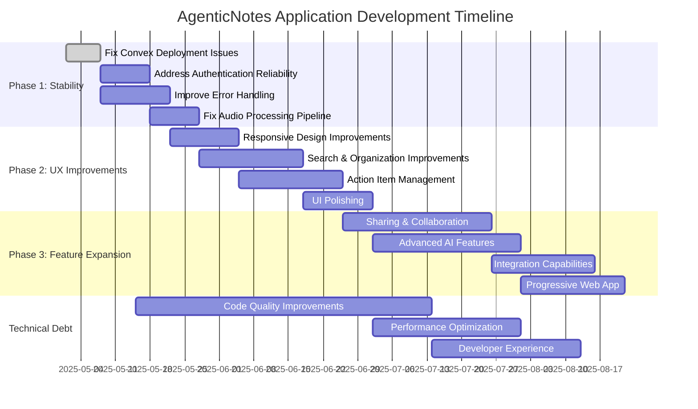

# Development Plan and Roadmap

## Current System Assessment

Based on the thorough code review, the AgenticNotes application has solid foundations but could benefit from several improvements in reliability, features, and code quality.

## Development Plan Checklist

### Phase 1: Stability & Bug Fixes

- [ ] **Fix Convex Deployment Issues**
  - [x] Resolve "spawn EINVAL" errors with Node.js v23+ compatibility
  - [x] Document workaround using `npx -p node@18.17.0`
  - [ ] Create convenience scripts for deployment

- [ ] **Address Authentication Reliability**
  - [ ] Implement more robust error handling for auth token issues
  - [ ] Add token refresh mechanisms
  - [ ] Create fallback UI for authentication errors

- [ ] **Improve Error Handling**
  - [x] Add comprehensive logging to backend functions
  - [ ] Implement user-friendly error messages and recovery
  - [ ] Add monitoring for failed API calls

- [ ] **Fix Audio Processing Pipeline**
  - [x] Address Replicate billing requirements
  - [x] Fix LLM model compatibility with Together.ai
  - [ ] Add fallback processing options when APIs fail
  - [ ] Implement retry mechanisms for transient failures

### Phase 2: User Experience Enhancements

- [ ] **Responsive Design Improvements**
  - [ ] Fix layout shift issues when refreshing
  - [ ] Add loading states for all async operations
  - [ ] Optimize for various mobile devices
  - [ ] Ensure consistent spacing and alignment

- [ ] **Search & Organization Improvements**
  - [ ] Implement auto-search on input
  - [ ] Add filters for notes by date, length, etc.
  - [ ] Create folder/category organization system
  - [ ] Add sort options for notes listing

- [ ] **Action Item Management**
  - [ ] Add due dates for action items
  - [ ] Implement priority levels
  - [ ] Create notifications for upcoming items
  - [ ] Add batch operations for action items

- [ ] **UI Polishing**
  - [ ] Animate action item completion
  - [ ] Add transition animations between views
  - [ ] Improve microphone animation during recording
  - [ ] Enhance overall visual consistency

### Phase 3: Feature Expansion

- [ ] **Sharing & Collaboration**
  - [ ] Add note sharing capabilities
  - [ ] Implement collaborative editing
  - [ ] Create team workspaces
  - [ ] Add commenting on shared notes

- [ ] **Advanced AI Features**
  - [ ] Implement custom prompts for analysis
  - [ ] Add sentiment analysis for notes
  - [ ] Create topic clustering for organization
  - [ ] Add multi-language support

- [ ] **Integration Capabilities**
  - [ ] Build Notion integration
  - [ ] Add calendar integration for action items
  - [ ] Implement email digests of notes/actions
  - [ ] Create API for third-party integrations

- [ ] **Progressive Web App**
  - [ ] Implement offline capabilities
  - [ ] Add installation support
  - [ ] Enable background sync
  - [ ] Implement push notifications

## Technical Debt Reduction

- [ ] **Code Quality Improvements**
  - [ ] Add comprehensive test coverage
  - [ ] Implement CI/CD pipeline
  - [ ] Refactor components for better reusability
  - [ ] Improve TypeScript type safety

- [ ] **Performance Optimization**
  - [ ] Implement code splitting
  - [ ] Add query caching strategies
  - [ ] Optimize bundle size
  - [ ] Implement lazy loading for components

- [ ] **Developer Experience**
  - [ ] Create comprehensive API documentation
  - [ ] Add storybook for UI components
  - [ ] Implement schema validation
  - [ ] Create development environment tools

## Implementation Timeline

## Resource Allocation

### Engineering Resources

- **Frontend Engineer**: Focus on UI/UX improvements and component development
- **Backend Engineer**: Focus on Convex functions, authentication, and API integrations
- **Full-stack Engineer**: Connect components and implement cross-cutting features
- **DevOps**: Setup CI/CD pipeline and deployment automation

### External Dependencies

- **Clerk**: Authentication service updates and integration
- **Convex**: Backend service capabilities and limitations
- **Together.ai**: LLM model availability and pricing
- **Replicate**: Whisper model availability and pricing

## Success Metrics

### Reliability Metrics

- Reduce error rate in audio processing pipeline by 95%
- Achieve 99.9% successful note creation rate
- Reduce authentication failures to less than 0.1%

### Performance Metrics

- Average note processing time under 10 seconds
- Frontend load time under 2 seconds
- Search response time under 500ms

### User Experience Metrics

- User satisfaction score above 4.5/5
- Feature usage increase by 30%
- Session duration increase by 25%
- User retention increase by 20%

## Risk Assessment

### Identified Risks

| Risk | Impact | Probability | Mitigation |
|------|--------|------------|------------|
| API service outages | High | Medium | Implement fallback mechanisms, caching |
| Authentication failures | High | Low | Robust error handling, token refresh |
| Cost increases from AI providers | Medium | High | Implement usage limits, cost monitoring |
| Browser compatibility issues | Medium | Medium | Cross-browser testing, progressive enhancement |
| Data loss | High | Low | Regular backups, data validation |

### Contingency Plans

1. **For API outages**: Implement offline mode with sync when service returns
2. **For auth failures**: Provide clear user guidance and automatic retry
3. **For cost increases**: Implement tiered usage plans and alternative providers
4. **For browser issues**: Maintain browser support documentation and fallbacks
5. **For data concerns**: Create data recovery tools and export functionality
