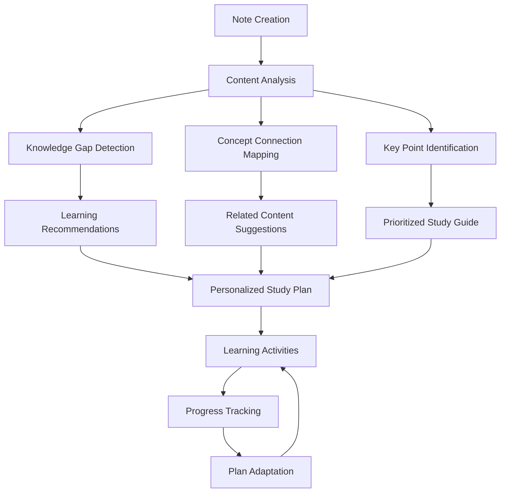

# Enhanced Note-Taking Application: Feature Roadmap

## Core Enhancements

This document outlines ambitious new features that can be integrated into the Notes application, with a focus on Gemini API integration and agentic workflows.

## 1. Voice Enhancement Features

### ElevenLabs Voice Integration

- **AI Voice Readback**: Convert notes to spoken content with natural-sounding voices
- **Voice Customization**: Allow users to create or select voices for playback
- **Multilingual Voice Support**: Support for multiple languages and accents
- **Emotion-aware Narration**: Adjust tone based on content sentiment
- **Speed and Pitch Control**: Customize playback speed and voice characteristics

### Advanced Audio Processing

- **Speaker Diarization**: Identify and label different speakers in recordings
- **Background Noise Reduction**: Enhanced audio cleaning for better transcription
- **Audio Bookmarking**: Mark important moments in audio recordings
- **Voice Commands**: Control the application through voice instructions
- **Live Translation**: Real-time translation during recording

## 2. Agentic Workflow Features

### Study Agent

- **Knowledge Graph Building**: Automatically map relationships between concepts
- **Learning Gap Analysis**: Identify areas where understanding seems incomplete
- **Study Schedule Generation**: Create optimized study plans based on note content
- **Concept Mastery Tracking**: Monitor comprehension of different topics over time
- **Spaced Repetition Integration**: Schedule review of important concepts at optimal intervals

### Research Agent

- **Automatic Citation Finding**: Locate and format citations for concepts mentioned
- **Source Credibility Assessment**: Evaluate the reliability of referenced materials
- **Related Research Suggestions**: Recommend additional reading materials
- **Contradiction Detection**: Highlight when notes contain conflicting information
- **Fact Verification**: Check factual claims against reliable sources

### Writing Agent

- **Essay Outline Generation**: Convert notes into structured essay outlines
- **Argument Enhancement**: Suggest ways to strengthen arguments in notes
- **Style Consistency**: Ensure consistent writing style across notes
- **Citation Formatting**: Automatically format citations in various academic styles
- **Plagiarism Prevention**: Check for unintentional similarity to existing sources

## 3. Multimodal Enhancement Features

### Image Processing

- **Handwriting Recognition**: Convert handwritten notes to text
- **Diagram Interpretation**: Extract concepts and relationships from diagrams
- **Whiteboard Capture**: Process photos of whiteboards into structured notes
- **Visual Note Organization**: Arrange notes visually using spatial relationships
- **Image-to-Concept Mapping**: Connect images to related concepts in notes

### Mixed Media Notes

- **Rich Media Embedding**: Seamlessly include images, audio, and video in notes
- **Cross-Media Search**: Find content across different media types
- **Media Summarization**: Generate text summaries of image and video content
- **Interactive Diagrams**: Create and modify diagrams using text descriptions
- **Media Timeline**: Organize mixed media chronologically

## 4. Collaborative Learning Features

### Group Note Enhancement

- **Collaborative Editing**: Real-time multi-user note editing
- **Contribution Tracking**: Monitor individual contributions to group notes
- **Comment and Discussion**: Thread-based discussions on specific parts of notes
- **Role-Based Collaboration**: Assign different roles (recorder, organizer, researcher)
- **Consensus Highlighting**: Identify areas of agreement and disagreement

### Knowledge Sharing

- **Note Publishing**: Share polished notes with classmates or publicly
- **Template Sharing**: Create and share note templates for different subjects
- **Annotation Layers**: Add personal annotations to shared notes
- **Study Group Formation**: Connect with students studying similar topics
- **Expert Verification**: Get notes reviewed by subject matter experts

## 5. Context-Aware Features

### Academic Context Integration

- **Syllabus Alignment**: Connect notes to course syllabus topics
- **Assignment Tracking**: Link notes to upcoming assignments and deadlines
- **Exam Preparation**: Generate practice questions based on note content
- **Academic Calendar Integration**: Schedule study sessions based on academic calendar
- **Learning Objective Mapping**: Connect notes to formal learning objectives

### Personal Context Understanding

- **Learning Style Adaptation**: Adjust note organization to personal learning style
- **Attention Analysis**: Identify times and environments of highest note quality
- **Knowledge Evolution Tracking**: Visualize how understanding evolves over time
- **Interest Highlighting**: Identify topics that generate most engagement
- **Confusion Detection**: Flag areas where notes suggest misunderstanding

## 6. Advanced AI Integration Features

### Gemini-Specific Capabilities

- **Multimodal Understanding**: Process and connect text, images, and audio
- **Deep Knowledge Integration**: Access to Google's knowledge graph for enrichment
- **Contextual Response Generation**: Generate content that fits user's exact context
- **Adaptive Prompting**: Automatically refine prompts based on previous results
- **Chain-of-Thought Processing**: Show reasoning process for complex analyses

### Cross-Service AI Orchestration

- **Hybrid Processing Pipelines**: Combine specialized AI services for optimal results
- **Fallback Chains**: Gracefully handle service outages with alternative processing
- **Cost Optimization**: Use appropriate models based on task complexity
- **Result Comparison**: Compare outputs from different AI services
- **Federated Learning**: Improve performance while preserving privacy

## 7. User Experience Enhancements

### Adaptive Interface

- **Contextual UI**: Interface adapts based on task and content
- **Progressive AI Assistance**: Adjustable levels of AI involvement
- **Custom Workspaces**: Create specialized environments for different subjects
- **Focus Mode**: Distraction-free environment for concentrated note-taking
- **Review Mode**: Optimized layout for studying from notes

### Cognitive Enhancement

- **Attention Guidance**: Highlight most important elements when reviewing
- **Memory Optimization**: Structure information for better recall
- **Comprehension Checks**: Interactive elements to test understanding
- **Visualization Generation**: Convert complex text to visual representations
- **Concept Simplification**: Explain difficult concepts in simpler terms

## Implementation Priority Matrix

| Feature | Impact | Implementation Complexity | Priority |
|---------|--------|--------------------------|----------|
| Gemini API Integration | High | Medium | 1 |
| Knowledge Graph Building | High | High | 2 |
| Handwriting Recognition | High | Medium | 3 |
| Study Schedule Generation | Medium | Medium | 4 |
| ElevenLabs Voice Integration | Medium | Low | 5 |
| Collaborative Editing | High | High | 6 |
| Exam Question Generation | High | Medium | 7 |
| Syllabus Alignment | Medium | Medium | 8 |
| Citation Finding | Medium | Low | 9 |
| Rich Media Embedding | Medium | Medium | 10 |

## Phased Implementation Approach

### Phase 1: Foundation & Core AI Integration
- Replace Together.ai with Gemini API
- Implement basic multimodal processing
- Enhance summarization and action item extraction
- Develop knowledge graph foundation

### Phase 2: Agentic Workflows
- Implement Study Agent
- Add Research Agent basics
- Develop adaptive interface elements
- Create contextual prompting system

### Phase 3: Voice & Media Enhancements
- Integrate ElevenLabs for voice playback
- Implement handwriting recognition
- Add rich media embedding
- Develop mixed media search

### Phase 4: Collaboration & Advanced Features
- Add collaborative editing
- Implement syllabus alignment
- Add exam preparation features
- Develop publication and sharing capabilities
