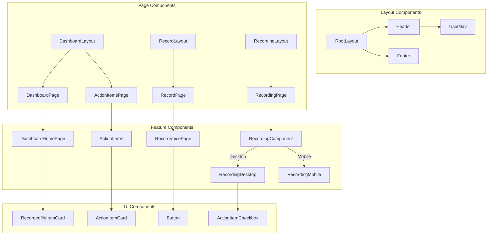

# Frontend Components Documentation

## Overview

The AgenticNotes application frontend is built with Next.js, React, and Tailwind CSS. It follows a component-based architecture with a clear separation between pages and reusable UI components.

## Page Structure

### Main Pages

| Page | Route | Description |
|------|-------|-------------|
| Landing Page | `/` | Public landing page with product information |
| Dashboard | `/dashboard` | Shows all user notes and search functionality |
| Action Items | `/dashboard/action-items` | Displays all action items across notes |
| Record | `/record` | Interface for recording new voice notes |
| Recording View | `/recording/[id]` | Displays a specific note with its transcript and action items |

## Key Components

### Page Components

#### `DashboardHomePage`

Manages the dashboard view with search functionality and note listing.

**Key Features:**
- Client-side data fetching using `useQuery`
- Semantic search using Together.ai embeddings
- Dynamic filtering of notes based on search results
- Links to create new recordings and view action items

#### `RecordVoicePage`

Provides the interface for recording voice notes.

**Key Features:**
- Real-time audio recording using MediaRecorder API
- Timer display for recording duration
- Direct upload to Convex storage
- Error handling for missing environment variables

#### `RecordingDesktop` / `RecordingMobile`

Display recorded notes with their transcription, summary, and action items.

**Key Features:**
- Responsive design with dedicated mobile and desktop components
- Toggle between transcript and summary views
- Action item management (mark as complete)
- Formatting of note metadata

### UI Components

#### `Header`

Application header with navigation and user menu.

**Key Features:**
- Responsive design
- User avatar and dropdown menu
- Navigation links

#### `UserNav`

User navigation dropdown menu.

**Key Features:**
- User profile information
- Sign out functionality
- Clerk integration

#### `RecordedfileItemCard`

Card component for displaying note previews in the dashboard.

**Key Features:**
- Note title and creation date
- Action item count badge
- Link to detailed view

## Component Hierarchy

## State Management

The application uses a combination of approaches for state management:

1. **Local React State**: For component-specific UI state like toggle states and form inputs
2. **Convex Real-time Data**: For application data fetched directly from the backend
3. **URL Parameters**: For routing and identifying resources

### Key Hooks and Utilities

- **`useQuery`**: Fetches real-time data from Convex backend
- **`useMutation`**: Triggers mutations on Convex backend
- **`useAction`**: Executes Convex actions like semantic search
- **`useUser`**: Accesses the current user from Clerk

## Responsive Design

The application is fully responsive with different layouts for:

- **Mobile**: Optimized for small screens with simplified layouts
- **Tablet**: Intermediate layout with adjusted spacing
- **Desktop**: Full layout with multiple columns and wider components

Tailwind CSS is used throughout for consistent styling and responsive behavior.

## Error Handling and Loading States

The frontend implements several patterns for handling asynchronous operations:

1. **Loading Indicators**: Shown while data is being fetched
2. **Error States**: Displayed when operations fail
3. **Fallback Content**: Used when data is unavailable
4. **Status Monitoring**: Tracking of asynchronous processing (transcription, title generation, etc.)
