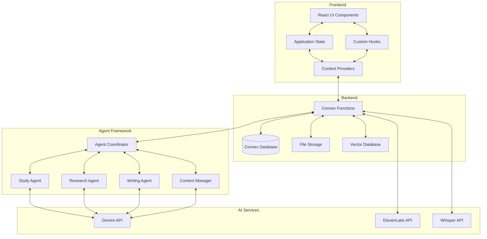

# Gemini-Powered Note-Taking Application: Development Plan

## Project Overview

This document outlines the comprehensive development plan for transforming the existing Notes application into an advanced, Gemini-powered note-taking platform with agentic workflows. The plan includes technical approach, implementation phases, resource requirements, and evaluation metrics.

## 1. Technical Foundations

### System Architecture



### Data Models

#### Enhanced Schema Design

Building on the existing schema, we'll introduce new tables and fields:

```typescript
// Enhanced schema.ts
import { defineSchema, defineTable } from 'convex/server';
import { v } from 'convex/values';

export default defineSchema({
  // Existing tables with enhancements
  notes: defineTable({
    userId: v.string(),
    audioFileId: v.optional(v.id('_storage')),
    audioFileUrl: v.optional(v.string()),
    imageFileIds: v.optional(v.array(v.id('_storage'))),
    title: v.optional(v.string()),
    transcription: v.optional(v.string()),
    summary: v.optional(v.string()),
    embedding: v.optional(v.array(v.float64())),
    generatingTranscript: v.optional(v.boolean()),
    generatingTitle: v.optional(v.boolean()),
    generatingActionItems: v.optional(v.boolean()),
    // New fields
    noteType: v.optional(v.string()), // 'lecture', 'study', 'research', etc.
    courseId: v.optional(v.id('courses')),
    aiEnhanced: v.optional(v.boolean()),
    attachments: v.optional(v.array(v.object({
      type: v.string(),
      fileId: v.id('_storage'),
      url: v.string(),
      name: v.string(),
    }))),
    tags: v.optional(v.array(v.string())),
    collaborators: v.optional(v.array(v.string())), // user IDs
    knowledgeGraph: v.optional(v.id('knowledgeGraphs')),
  }).index('by_userId', ['userId'])
    .index('by_courseId', ['courseId'])
    .index('by_tags', ['tags'])
    .vectorIndex('by_embedding', {
      vectorField: 'embedding',
      dimensions: 768,
      filterFields: ['userId', 'courseId'],
    }),
  
  // New tables
  courses: defineTable({
    userId: v.string(),
    name: v.string(),
    description: v.optional(v.string()),
    syllabus: v.optional(v.string()),
    startDate: v.optional(v.string()),
    endDate: v.optional(v.string()),
    instructor: v.optional(v.string()),
    color: v.optional(v.string()),
  }).index('by_userId', ['userId']),
  
  knowledgeGraphs: defineTable({
    noteId: v.id('notes'),
    userId: v.string(),
    concepts: v.array(v.object({
      id: v.string(),
      name: v.string(),
      description: v.optional(v.string()),
      importance: v.number(),
    })),
    relationships: v.array(v.object({
      source: v.string(), // concept id
      target: v.string(), // concept id
      type: v.string(), // 'is_a', 'part_of', 'related_to', etc.
      weight: v.optional(v.number()),
    })),
  }).index('by_noteId', ['noteId'])
    .index('by_userId', ['userId']),
  
  studyPlans: defineTable({
    userId: v.string(),
    courseId: v.optional(v.id('courses')),
    title: v.string(),
    description: v.optional(v.string()),
    startDate: v.string(),
    endDate: v.string(),
    goals: v.array(v.object({
      id: v.string(),
      description: v.string(),
      completed: v.boolean(),
    })),
    schedule: v.array(v.object({
      date: v.string(),
      duration: v.number(), // minutes
      topic: v.string(),
      noteIds: v.optional(v.array(v.id('notes'))),
      completed: v.boolean(),
    })),
  }).index('by_userId', ['userId'])
    .index('by_courseId', ['courseId']),
});
```

### API Integrations

#### Gemini API Integration

```typescript
// gemini.ts
import { GoogleGenerativeAI } from '@google/generative-ai';
import { internalAction } from './generated/server';
import { v } from 'convex/values';

const genAI = new GoogleGenerativeAI(process.env.GEMINI_API_KEY as string);

export const generateSummary = internalAction({
  args: {
    noteId: v.id('notes'),
    transcript: v.string(),
  },
  handler: async (ctx, args) => {
    // Initialize the model
    const model = genAI.getGenerativeModel({ model: "gemini-pro" });
    
    // Create the prompt
    const prompt = `Summarize the following transcript in a concise way that captures the main points and is easy to understand:

${args.transcript}`;
    
    // Generate the response
    const result = await model.generateContent(prompt);
    const response = await result.response;
    const summary = response.text();
    
    // Return the summary
    return summary;
  },
});

export const extractConcepts = internalAction({
  args: {
    noteId: v.id('notes'),
    transcript: v.string(),
  },
  handler: async (ctx, args) => {
    const model = genAI.getGenerativeModel({ model: "gemini-pro" });
    
    const prompt = `Extract the key concepts from this transcript and return them as a JSON array of objects.
    Each object should have a "name" (the concept name), a "description" (brief explanation), and an "importance" (1-10 scale).
    
    Transcript:
    ${args.transcript}`;
    
    const result = await model.generateContent(prompt);
    const response = await result.response;
    const conceptsText = response.text();
    
    try {
      const concepts = JSON.parse(conceptsText);
      return concepts;
    } catch (error) {
      console.error("Failed to parse concepts:", error);
      return [];
    }
  },
});
```

#### ElevenLabs Integration

```typescript
// elevenlabs.ts
import { internalAction } from './generated/server';
import { v } from 'convex/values';
import axios from 'axios';

export const textToSpeech = internalAction({
  args: {
    text: v.string(),
    voiceId: v.optional(v.string()),
  },
  handler: async (ctx, args) => {
    const API_KEY = process.env.ELEVENLABS_API_KEY;
    const voiceId = args.voiceId || "21m00Tcm4TlvDq8ikWAM"; // Default voice
    
    try {
      const response = await axios.post(
        `https://api.elevenlabs.io/v1/text-to-speech/${voiceId}`,
        {
          text: args.text,
          model_id: "eleven_monolingual_v1",
          voice_settings: {
            stability: 0.5,
            similarity_boost: 0.5
          }
        },
        {
          headers: {
            'Content-Type': 'application/json',
            'xi-api-key': API_KEY
          },
          responseType: 'arraybuffer'
        }
      );
      
      // Convert array buffer to base64
      const audioBase64 = Buffer.from(response.data).toString('base64');
      return { success: true, audioBase64 };
    } catch (error) {
      console.error("ElevenLabs API error:", error);
      return { success: false, error: "Failed to generate speech" };
    }
  },
});
```

## 2. Agent Framework Design

### Agent Coordinator

The Agent Coordinator manages the interaction between different specialized agents:

```typescript
// agent-coordinator.ts
import { internalAction } from './generated/server';
import { v } from 'convex/values';

export const processNote = internalAction({
  args: {
    noteId: v.id('notes'),
    userId: v.string(),
    context: v.optional(v.object({
      courseId: v.optional(v.id('courses')),
      requestedAgents: v.optional(v.array(v.string())),
      userPreferences: v.optional(v.any()),
    })),
  },
  handler: async (ctx, args) => {
    // 1. Retrieve the note
    const note = await ctx.runQuery(internal.notes.getNote, {
      id: args.noteId,
    });
    
    if (!note) {
      return { success: false, error: "Note not found" };
    }
    
    // 2. Determine which agents to use
    const agentsToRun = args.context?.requestedAgents || ['study', 'research'];
    
    // 3. Plan the processing sequence
    const processingResults = {};
    
    // 4. Execute the agents in appropriate order
    if (agentsToRun.includes('study')) {
      processingResults.study = await ctx.runAction(internal.agents.study.analyzeNote, {
        noteId: args.noteId,
        userId: args.userId,
      });
    }
    
    if (agentsToRun.includes('research')) {
      processingResults.research = await ctx.runAction(internal.agents.research.findReferences, {
        noteId: args.noteId,
        userId: args.userId,
        concepts: processingResults.study?.concepts || [],
      });
    }
    
    if (agentsToRun.includes('writing')) {
      processingResults.writing = await ctx.runAction(internal.agents.writing.enhanceContent, {
        noteId: args.noteId,
        userId: args.userId,
      });
    }
    
    // 5. Consolidate results and update the note
    const updateData = {};
    
    if (processingResults.study?.summary) {
      updateData.summary = processingResults.study.summary;
    }
    
    if (processingResults.study?.knowledgeGraph) {
      // Create or update knowledge graph
      const graphId = await ctx.runMutation(internal.knowledge.saveKnowledgeGraph, {
        noteId: args.noteId,
        userId: args.userId,
        concepts: processingResults.study.knowledgeGraph.concepts,
        relationships: processingResults.study.knowledgeGraph.relationships,
      });
      
      updateData.knowledgeGraph = graphId;
    }
    
    // Update the note with consolidated results
    await ctx.runMutation(internal.notes.updateNote, {
      id: args.noteId,
      data: updateData,
    });
    
    return { success: true, results: processingResults };
  },
});
```

### Study Agent

```typescript
// agents/study.ts
import { internalAction } from '../generated/server';
import { v } from 'convex/values';
import { GoogleGenerativeAI } from '@google/generative-ai';

const genAI = new GoogleGenerativeAI(process.env.GEMINI_API_KEY as string);

export const analyzeNote = internalAction({
  args: {
    noteId: v.id('notes'),
    userId: v.string(),
  },
  handler: async (ctx, args) => {
    // 1. Get the note content
    const note = await ctx.runQuery(internal.notes.getNote, {
      id: args.noteId,
    });
    
    if (!note || !note.transcription) {
      return { success: false, error: "Note or transcription not found" };
    }
    
    const model = genAI.getGenerativeModel({ model: "gemini-pro" });
    
    // 2. Generate summary
    const summaryPrompt = `Create a comprehensive summary of these notes that captures the main concepts, key points, and important details:

${note.transcription}`;
    
    const summaryResult = await model.generateContent(summaryPrompt);
    const summary = summaryResult.response.text();
    
    // 3. Extract concepts for knowledge graph
    const conceptsPrompt = `Analyze these notes and extract the key concepts and their relationships.
    Return a JSON object with the following structure:
    {
      "concepts": [
        {"id": "unique_string", "name": "concept_name", "description": "brief description", "importance": number_1_to_10},
      ],
      "relationships": [
        {"source": "concept_id", "target": "concept_id", "type": "relationship_type", "weight": number_0_to_1},
      ]
    }
    
    Notes:
    ${note.transcription}`;
    
    const conceptsResult = await model.generateContent(conceptsPrompt);
    const conceptsText = conceptsResult.response.text();
    
    let knowledgeGraph;
    try {
      knowledgeGraph = JSON.parse(conceptsText);
    } catch (error) {
      console.error("Failed to parse knowledge graph:", error);
      knowledgeGraph = { concepts: [], relationships: [] };
    }
    
    // 4. Identify knowledge gaps
    const gapsPrompt = `Review these notes and identify potential knowledge gaps or areas that need clarification:

${note.transcription}`;
    
    const gapsResult = await model.generateContent(gapsPrompt);
    const knowledgeGaps = gapsResult.response.text();
    
    return {
      success: true,
      summary,
      knowledgeGraph,
      knowledgeGaps,
    };
  },
});
```

## 3. Implementation Phases

### Phase 1: Core Integration & Long Recording Support (Weeks 1-5)

#### Week 1: Setup and Initial Integration

- [ ] Set up Gemini API integration and authentication
- [ ] Create base agent framework structure
- [ ] Implement enhanced data schema
- [ ] Develop initial testing framework

#### Week 2: Local Whisper Integration

- [ ] Implement local Whisper installation and configuration
- [ ] Create fallback mechanism between local and API processing
- [ ] Develop processing queue for large audio files
- [ ] Add configuration UI for selecting processing method

#### Week 3: Basic Functionality

- [ ] Replace Together.ai with Gemini for summarization
- [ ] Implement concept extraction functionality
- [ ] Create basic knowledge graph visualization
- [ ] Develop initial API wrappers

#### Week 4: Agent Implementation

- [ ] Implement Study Agent core functionality
- [ ] Create Agent Coordinator
- [ ] Add basic research capabilities
- [ ] Implement context manager

#### Week 5: Long Recording & Multi-Language Support

- [ ] Implement chunked recording system for 3-hour lectures
- [ ] Create noise reduction preprocessing for classroom environments
- [ ] Develop speaker diarization for instructor/student distinction
- [ ] Add partial results display during ongoing processing
- [ ] Implement background processing for uninterrupted usage
- [ ] Add multi-language support for transcription (15+ languages)
- [ ] Create language-specific processing for non-English content
- [ ] Implement language auto-detection capabilities
- [ ] Develop UI for language selection and preferences

#### Week 6: Integration & Testing

- [ ] Connect agents to UI
- [ ] Implement feedback mechanisms
- [ ] Test core functionality
- [ ] Debug and optimize performance

### Phase 2: Enhanced Features (Weeks 7-10)

#### Week 7: Voice & Media

- [ ] Integrate ElevenLabs for voice playback
- [ ] Implement speaker diarization
- [ ] Add voice commands
- [ ] Develop audio bookmarking

#### Week 8: Multimodal Processing

- [ ] Add image note support
- [ ] Implement handwriting recognition
- [ ] Create mixed media notes
- [ ] Develop diagram interpretation

#### Week 9: Advanced Analysis

- [ ] Implement knowledge gap detection
- [ ] Add learning recommendations
- [ ] Create study schedule generation
- [ ] Develop content connections

#### Week 10: UI/UX Refinement

- [ ] Implement adaptive interface
- [ ] Add progressive AI assistance
- [ ] Create custom workspaces
- [ ] Develop review mode

### Phase 3: Collaborative & Advanced (Weeks 11-14)

#### Week 11: Collaborative Features

- [ ] Implement real-time collaboration
- [ ] Add commenting system
- [ ] Create role-based collaboration
- [ ] Develop note publishing

#### Week 12: Academic Integration

- [ ] Implement syllabus alignment
- [ ] Add course management
- [ ] Create exam preparation features
- [ ] Develop citation tools

#### Week 13: Advanced AI Features

- [ ] Implement chain-of-thought processing
- [ ] Add cross-service orchestration
- [ ] Create advanced reasoning
- [ ] Develop personalized learning

#### Week 14: Finalization

- [ ] Comprehensive testing
- [ ] Performance optimization
- [ ] Documentation updates
- [ ] Final polishing

## 4. Technical Implementation Details

### Frontend Updates

```typescript
// components/NoteAnalysis.tsx
import React, { useState, useEffect } from 'react';
import { useMutation, useQuery } from 'convex/react';
import { api } from '@/convex/_generated/api';
import KnowledgeGraphVisualization from './KnowledgeGraphVisualization';
import StudyRecommendations from './StudyRecommendations';

interface NoteAnalysisProps {
  noteId: string;
}

export default function NoteAnalysis({ noteId }: NoteAnalysisProps) {
  const [activeTab, setActiveTab] = useState('summary');
  
  // Get note data including AI enhancements
  const noteData = useQuery(api.notes.getNote, { id: noteId });
  
  // Trigger AI processing if needed
  const processNote = useMutation(api.agents.processNote);
  
  useEffect(() => {
    if (noteData?.note && !noteData.note.aiEnhanced) {
      processNote({ noteId, context: { requestedAgents: ['study', 'research'] } });
    }
  }, [noteData, noteId, processNote]);
  
  if (!noteData || !noteData.note) {
    return <div className="p-4">Loading note data...</div>;
  }
  
  return (
    <div className="bg-white rounded-lg shadow-lg p-6">
      <div className="flex border-b mb-4">
        <button
          className={`px-4 py-2 ${activeTab === 'summary' ? 'border-b-2 border-blue-500 text-blue-500' : 'text-gray-600'}`}
          onClick={() => setActiveTab('summary')}
        >
          Summary
        </button>
        <button
          className={`px-4 py-2 ${activeTab === 'concepts' ? 'border-b-2 border-blue-500 text-blue-500' : 'text-gray-600'}`}
          onClick={() => setActiveTab('concepts')}
        >
          Knowledge Graph
        </button>
        <button
          className={`px-4 py-2 ${activeTab === 'study' ? 'border-b-2 border-blue-500 text-blue-500' : 'text-gray-600'}`}
          onClick={() => setActiveTab('study')}
        >
          Study Plan
        </button>
      </div>
      
      {activeTab === 'summary' && (
        <div className="prose max-w-none">
          <h2 className="text-xl font-bold mb-2">{noteData.note.title || 'Untitled Note'}</h2>
          <div className="mb-4">
            {noteData.note.summary ? (
              <div>{noteData.note.summary}</div>
            ) : (
              <div className="text-gray-500">Generating summary...</div>
            )}
          </div>
        </div>
      )}
      
      {activeTab === 'concepts' && (
        <div>
          <h2 className="text-xl font-bold mb-4">Knowledge Graph</h2>
          {noteData.note.knowledgeGraph ? (
            <KnowledgeGraphVisualization graphId={noteData.note.knowledgeGraph} />
          ) : (
            <div className="text-gray-500">Building knowledge graph...</div>
          )}
        </div>
      )}
      
      {activeTab === 'study' && (
        <div>
          <h2 className="text-xl font-bold mb-4">Study Recommendations</h2>
          <StudyRecommendations noteId={noteId} />
        </div>
      )}
    </div>
  );
}
```

### Backend Processing Pipeline

```typescript
// processing-pipeline.ts
import { internalMutation, internalAction } from './generated/server';
import { v } from 'convex/values';

export const initiateProcessing = internalMutation({
  args: {
    noteId: v.id('notes'),
  },
  handler: async (ctx, args) => {
    // Get the note
    const note = await ctx.db.get(args.noteId);
    if (!note) {
      throw new Error(`Note ${args.noteId} not found`);
    }
    
    // Initialize processing tracking
    await ctx.db.patch(args.noteId, {
      processingStatus: 'in_progress',
      processingStage: 'transcription',
      processingStarted: Date.now(),
      aiEnhanced: false,
    });
    
    // Start the processing pipeline
    if (note.audioFileUrl) {
      // For audio notes, start with transcription
      await ctx.scheduler.runAfter(0, internal.whisper.chat, {
        fileUrl: note.audioFileUrl,
        id: args.noteId,
      });
    } else if (note.transcription) {
      // For text notes, skip to AI processing
      await ctx.scheduler.runAfter(0, internal.agents.processNote, {
        noteId: args.noteId,
        userId: note.userId,
      });
    } else {
      // Cannot process
      await ctx.db.patch(args.noteId, {
        processingStatus: 'error',
        processingError: 'No content to process',
      });
    }
    
    return { status: 'initiated' };
  },
});
```

## 5. Resource Requirements

### Development Team

- **1 Full-Stack Engineer**: Responsible for overall architecture and integration
- **1 Frontend Developer**: Focus on React components and user experience
- **1 AI Specialist**: Work on prompt engineering and agent development
- **1 UX Designer**: Create user flows and interface designs

### Infrastructure

- **Convex Plan**: Premium tier for increased function execution and storage
- **Gemini API**: Pro tier for advanced LLM capabilities
- **ElevenLabs**: Standard subscription for voice synthesis
- **Development Environment**: Standard development tools and testing infrastructure

### Budget Considerations

| Item | Monthly Cost | Notes |
|------|--------------|-------|
| Development Team | $40,000 | 4 team members for 3 months |
| Convex Premium | $49 | Per developer, per month |
| Gemini API | $350 | Estimated monthly usage |
| ElevenLabs | $22 | Standard tier |
| Testing & Deployment | $200 | CI/CD, testing infrastructure |
| **Total Monthly** | **$40,621** | |
| **Project Total (3 months)** | **$121,863** | |

## 6. Evaluation & Success Metrics

### Key Performance Indicators

- **User Engagement**: 
  - Average time spent using the application
  - Frequency of note creation
  - Feature utilization rates

- **AI Performance**:
  - Accuracy of summaries (user rating)
  - Relevance of action items (completion rate)
  - Knowledge graph connectivity and usefulness

- **Technical Performance**:
  - Average processing time per note
  - Error rates in AI processing
  - System responsiveness and stability

### Testing Strategy

- **Unit Testing**: Individual components and functions
- **Integration Testing**: API integrations and data flow
- **User Testing**: Feedback from student pilot group
- **Performance Testing**: Load testing and optimization
- **Audio Processing**: Current Whisper API integration has length limitations and requires internet connection

**Solutions**:
- Implement local Whisper processing to handle 3-hour classroom recordings
- Create chunked recording system to manage large files
- Add noise reduction for classroom environments
- Use progressive loading of processing results
- Implement background processing with notifications

### Success Criteria

The project will be considered successful if:

1. 90% of test users report improved productivity in note-taking
2. Average processing time is under 10 seconds for standard notes
3. AI-generated content receives an average rating of 4/5 or higher
4. System can handle concurrent users with minimal performance degradation
5. Key features work consistently across browsers and devices

## 7. Risks & Mitigation

| Risk | Probability | Impact | Mitigation Strategy |
|------|------------|--------|---------------------|
| Gemini API limitations | Medium | High | Implement fallback processing, caching strategies |
| Complex user experience | Medium | High | Progressive feature rollout, extensive user testing |
| Performance bottlenecks | Medium | Medium | Optimization sprints, caching, lazy loading |
| Integration challenges | High | Medium | Modular architecture, robust error handling |
| Budget overruns | Medium | Medium | Phased implementation, regular milestone reviews |

## 8. Next Steps

1. **Finalize Architecture**: Confirm system design and component interactions
2. **Setup Development Environment**: Configure tools, repositories, and environments
3. **Create Detailed Sprint Plan**: Break down phases into specific sprint tasks
4. **Begin Phase 1 Implementation**: Start with core Gemini API integration
5. **Schedule Regular Reviews**: Set up weekly progress reviews and demonstrations

## Conclusion

This development plan outlines a comprehensive approach to transforming the existing Notes application into a powerful, Gemini-powered note-taking platform with agentic workflows. The phased implementation approach allows for incremental development and testing, while the modular architecture ensures flexibility and scalability. With the right resources and careful execution, this project has the potential to create a truly game-changing tool for students.
