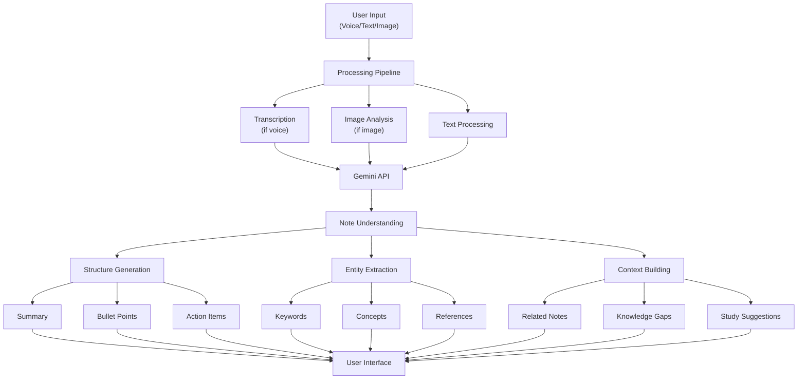

# Gemini-Powered Agentic Note-Taking Application: Research & Analysis

## Introduction

This document explores the development of an enhanced note-taking application built on top of Google's Gemini API, focusing on creating an agentic workflow similar to tools like Cursor and Windsurf. The goal is to create the ultimate note-taking experience for students, with advanced AI capabilities for summarization, action item extraction, bullet point generation, and more.

## Market & User Needs Analysis

### Student Note-Taking Pain Points

1. **Information Overload**: Students often struggle to capture all key information during lectures
2. **Organization Challenges**: Difficulty structuring notes in a way that aids recall and studying
3. **Action Item Management**: Important tasks and deadlines get buried in dense notes
4. **Time Constraints**: Limited time to review and synthesize lengthy notes
5. **Contextual Understanding**: Trouble connecting new information to previously learned concepts
6. **Multi-format Learning**: Different subjects require different note-taking approaches

### Competitive Landscape

| Application | Strengths | Weaknesses |
|-------------|-----------|------------|
| Notion | Flexible organization, Good integration | Limited AI capabilities, Complex learning curve |
| Evernote | Cross-platform, Good search | Outdated UI, Limited AI features |
| OneNote | Drawing capabilities, Microsoft integration | Sync issues, Basic AI features |
| Roam Research | Knowledge graph, Bidirectional linking | Expensive, Steep learning curve |
| Obsidian | Local storage, Plugin ecosystem | Limited mobile experience, No native AI |
| Apple Notes | Simplicity, Apple ecosystem integration | Limited features, Basic organization |

## Gemini API Capabilities

The Google Gemini API offers several capabilities that make it ideal for an enhanced note-taking application:

### Core Capabilities

1. **Text Comprehension**: Advanced understanding of context and concepts in notes
2. **Multimodal Processing**: Ability to work with text, images, and potentially audio inputs
3. **Text Generation**: High-quality summaries, bullet points, and explanations
4. **Structured Output**: Can generate specifically formatted responses (JSON, markdown, etc.)
5. **Context Retention**: Can maintain understanding across multiple related prompts
6. **Few-shot Learning**: Can quickly adapt to specific note-taking styles with examples

### Unique Advantages

1. **Knowledge Integration**: Deep integration with Google's knowledge graph
2. **Multilingual Support**: Strong performance across multiple languages
3. **Real-time Processing**: Fast response times for interactive experiences
4. **Safety Measures**: Built-in content filtering and moderation

## Agentic Workflows in Note-Taking

### What Makes a Workflow "Agentic"?

An agentic workflow empowers AI to act as a proactive assistant rather than a passive tool. Key characteristics include:

1. **Autonomy**: The system can perform tasks with minimal user guidance
2. **Proactivity**: The system anticipates user needs and suggests actions
3. **Context Awareness**: The system understands the broader context of the user's work
4. **Adaptivity**: The system learns from user interactions and improves over time
5. **Multi-step Processing**: The system can handle complex, multi-stage workflows

### Applied to Note-Taking

An agentic note-taking experience might include:

1. **Proactive Organization**: Automatically suggesting categories and tags for notes
2. **Smart Linking**: Identifying connections to previous notes or external information
3. **Question Anticipation**: Generating potential questions that might appear on exams
4. **Study Material Generation**: Creating flashcards, practice questions, and summaries
5. **Follow-up Prompting**: Suggesting areas to research further or clarification needed
6. **Contextual References**: Adding relevant sources, definitions, or examples

## Integration with Existing AgenticNotes Application

The current AgenticNotes application has a solid foundation with:

- Voice note recording capability
- Transcription using Whisper API
- LLM processing via Together.ai
- Action item extraction
- Vector search functionality

These features can be enhanced and expanded by integrating Gemini API:

1. **Replace Together.ai with Gemini**: Utilize Gemini's stronger contextual understanding
2. **Expand Multimodal Capabilities**: Process images alongside voice and text
3. **Enhance Search with Knowledge Graph**: Incorporate Google's knowledge for better search
4. **Implement Agentic Elements**: Add proactive assistance and context management
5. **Unified Format Handling**: Support multiple note formats (text, voice, images, diagrams)

## Technical Approach

### Architecture Considerations

1. **API Integration**: Direct integration with Gemini API, possibly using the official SDK
2. **Stateful Conversations**: Maintaining context across user sessions
3. **Backend Processing**: Offloading heavy processing to server-side functions
4. **Real-time Updates**: Ensuring changes propagate immediately to the user interface
5. **Caching Strategy**: Implementing efficient caching for API responses
6. **Fallback Mechanisms**: Handling API unavailability or rate limiting

### Data Flow Design

## Technical Challenges & Solutions

### Challenge 1: Context Management

**Challenge**: Maintaining and evolving context across note-taking sessions.

**Solutions**:
- Implement a context database with embeddings
- Use Gemini's context window efficiently
- Create abstraction layers for context management

### Challenge 2: Accuracy of Processing

**Challenge**: Ensuring accurate note summarization and action item extraction.

**Solutions**:
- Implement user feedback mechanisms for corrections
- Use domain-specific prompting for different subjects
- Develop confidence scoring for AI outputs

### Challenge 3: Performance & Responsiveness

**Challenge**: Keeping the application responsive despite heavy AI processing.

**Solutions**:
- Implement progressive loading of AI-generated content
- Use optimistic UI updates
- Leverage background processing and notifications

### Challenge 4: Privacy & Security

**Challenge**: Handling sensitive academic information with proper privacy.

**Solutions**:
- Implement client-side processing where possible
- Clear data retention policies
- Optional anonymization of certain content

## User Experience Considerations

### Interaction Design Principles

1. **Low Friction**: Minimize steps required to capture and process notes
2. **Progressive Disclosure**: Show basic functionality first, reveal advanced features as needed
3. **Flexible Control**: Allow users to adjust the level of AI assistance
4. **Transparent Processing**: Make it clear when and how AI is processing content
5. **Predictable Behavior**: Ensure consistent and expected results

### Key UX Moments

1. **Note Capture**: Quick, unobtrusive recording of information
2. **Processing Feedback**: Clear indication of AI processing status
3. **Result Review**: Easy scanning and verification of AI-generated content
4. **Correction Flow**: Simple mechanisms to fix AI mistakes
5. **Action Management**: Intuitive tracking of action items and deadlines

## Ethical Considerations

1. **Academic Integrity**: Ensuring the tool aids learning without enabling cheating
2. **Accessibility**: Making AI benefits available to diverse student populations
3. **Transparency**: Clearly distinguishing AI-generated content from user content
4. **Agency Preservation**: Keeping humans in control of important decisions
5. **Bias Mitigation**: Addressing potential biases in AI processing of educational content
