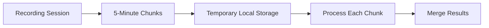

# Long Recording Support: Classroom Environment

## Overview

This document outlines the technical approach to support recordings up to 3 hours in length for classroom environments. The current implementation has limitations with browser-based recording and processing, which we'll address with the solutions below.

## Technical Challenges

1. **Browser Memory Limitations**: Browser-based recording can't reliably handle 3-hour sessions
2. **Upload Size Constraints**: Large audio files exceed standard upload limits
3. **Processing Timeouts**: API-based transcription services may time out on large files
4. **Background Noise**: Classroom environments have variable noise levels
5. **Multiple Speakers**: Need to distinguish between instructor and student voices

## Implementation Approach

### 1. Chunked Recording System



```typescript
// Implementation in recorder component
class LongRecordingManager {
  private chunks: Blob[] = [];
  private recorder: MediaRecorder | null = null;
  private chunkInterval: number = 5 * 60 * 1000; // 5 minutes in ms
  private currentChunkStartTime: number = 0;
  private isRecording: boolean = false;
  private totalDuration: number = 0;
  
  startRecording(stream: MediaStream) {
    this.isRecording = true;
    this.currentChunkStartTime = Date.now();
    
    // Initialize recorder
    this.recorder = new MediaRecorder(stream, {
      mimeType: 'audio/webm',
      audioBitsPerSecond: 128000 // Optimize for speech
    });
    
    // Set up event handlers
    this.recorder.ondataavailable = (event) => {
      if (event.data.size > 0) {
        this.chunks.push(event.data);
        this.processChunkIfNeeded();
      }
    };
    
    // Start the recorder
    this.recorder.start();
    
    // Set up chunk interval
    this.setupChunkInterval();
  }
  
  private setupChunkInterval() {
    setInterval(() => {
      if (this.isRecording && this.recorder?.state === 'recording') {
        // Stop current chunk and start a new one
        this.recorder.requestData();
        this.totalDuration += (Date.now() - this.currentChunkStartTime);
        this.currentChunkStartTime = Date.now();
      }
    }, this.chunkInterval);
  }
  
  private async processChunkIfNeeded() {
    if (this.chunks.length >= 1) {
      const chunk = this.chunks.shift();
      await this.uploadAndProcessChunk(chunk);
    }
  }
  
  private async uploadAndProcessChunk(chunk: Blob) {
    // Get upload URL
    const uploadUrl = await generateUploadUrl();
    
    // Upload the chunk
    await fetch(uploadUrl, {
      method: 'PUT',
      body: chunk
    });
    
    // Create a placeholder note or append to existing note
    // This will trigger the processing pipeline
  }
  
  stopRecording() {
    if (this.recorder && this.isRecording) {
      this.isRecording = false;
      this.recorder.stop();
      
      // Process any remaining chunks
      this.recorder.requestData();
    }
  }
}
```

### 2. Local Whisper Processing

We'll implement a local Whisper processing option to avoid API limitations for long recordings:

```typescript
// convex/whisper-local.ts
import { internalAction } from './_generated/server';
import { v } from 'convex/values';
import { spawn } from 'child_process';
import fs from 'fs';
import path from 'path';
import os from 'os';
import { internal } from './_generated/api';

export const processLocalWhisper = internalAction({
  args: {
    fileUrl: v.string(),
    id: v.id('notes'),
    useLocalWhisper: v.boolean(),
  },
  handler: async (ctx, args) => {
    // If not using local Whisper, fall back to the API version
    if (!args.useLocalWhisper) {
      return ctx.runAction(internal.whisper.chat, {
        fileUrl: args.fileUrl,
        id: args.id,
      });
    }
    
    try {
      // Download the file
      const response = await fetch(args.fileUrl);
      const arrayBuffer = await response.arrayBuffer();
      const buffer = Buffer.from(arrayBuffer);
      
      // Create temp directory
      const tmpDir = fs.mkdtempSync(path.join(os.tmpdir(), 'whisper-'));
      const audioFilePath = path.join(tmpDir, 'audio.webm');
      const outputPath = path.join(tmpDir, 'transcript.txt');
      
      // Write file to disk
      fs.writeFileSync(audioFilePath, buffer);
      
      // Run local Whisper
      return new Promise((resolve, reject) => {
        const whisperProcess = spawn('whisper', [
          audioFilePath,
          '--model', 'medium',
          '--output_format', 'txt',
          '--output_dir', tmpDir,
          '--language', 'en'
        ]);
        
        let stdoutData = '';
        let stderrData = '';
        
        whisperProcess.stdout.on('data', (data) => {
          stdoutData += data.toString();
        });
        
        whisperProcess.stderr.on('data', (data) => {
          stderrData += data.toString();
        });
        
        whisperProcess.on('close', (code) => {
          if (code !== 0) {
            console.error(`Whisper process exited with code ${code}`);
            console.error(stderrData);
            reject(new Error(`Whisper process failed: ${stderrData}`));
            return;
          }
          
          // Read the transcript
          const transcript = fs.readFileSync(outputPath, 'utf8');
          
          // Clean up temp files
          fs.unlinkSync(audioFilePath);
          fs.unlinkSync(outputPath);
          fs.rmdirSync(tmpDir);
          
          // Save the transcript
          ctx.runMutation(internal.whisper.saveTranscript, {
            id: args.id,
            transcript,
          });
          
          resolve({ success: true, transcript });
        });
      });
    } catch (error) {
      console.error('Error processing with local Whisper:', error);
      return { success: false, error: error.message };
    }
  },
});
```

### 3. Noise Reduction Implementation

```typescript
// components/AudioPreprocessor.ts
export class AudioPreprocessor {
  private context: AudioContext;
  private sourceNode: MediaStreamAudioSourceNode | null = null;
  private gainNode: GainNode | null = null;
  private analyserNode: AnalyserNode | null = null;
  private filterNode: BiquadFilterNode | null = null;
  private compressorNode: DynamicsCompressorNode | null = null;
  
  constructor() {
    this.context = new AudioContext();
  }
  
  // Process stream and apply noise reduction
  processStream(stream: MediaStream): MediaStream {
    // Create nodes
    this.sourceNode = this.context.createMediaStreamSource(stream);
    this.analyserNode = this.context.createAnalyser();
    this.filterNode = this.context.createBiquadFilter();
    this.compressorNode = this.context.createDynamicsCompressor();
    this.gainNode = this.context.createGain();
    
    // Configure filter for noise reduction
    this.filterNode.type = 'highpass';
    this.filterNode.frequency.value = 100; // Filter out low frequency noise
    
    // Configure compressor for voice clarity
    this.compressorNode.threshold.value = -24;
    this.compressorNode.knee.value = 30;
    this.compressorNode.ratio.value = 12;
    this.compressorNode.attack.value = 0.003;
    this.compressorNode.release.value = 0.25;
    
    // Connect the audio graph
    this.sourceNode.connect(this.filterNode);
    this.filterNode.connect(this.compressorNode);
    this.compressorNode.connect(this.gainNode);
    this.gainNode.connect(this.analyserNode);
    
    // Create the processed output stream
    const destination = this.context.createMediaStreamDestination();
    this.analyserNode.connect(destination);
    
    return destination.stream;
  }
  
  // Analyze audio to detect voice vs. background noise
  analyzeAudioSignal() {
    if (!this.analyserNode) return;
    
    const bufferLength = this.analyserNode.frequencyBinCount;
    const dataArray = new Uint8Array(bufferLength);
    this.analyserNode.getByteFrequencyData(dataArray);
    
    // Calculate average signal strength
    const average = dataArray.reduce((sum, value) => sum + value, 0) / bufferLength;
    
    // Adjust gain based on signal strength
    if (this.gainNode) {
      // Boost signal if it's too low (likely speech)
      if (average < 50) {
        this.gainNode.gain.value = 1.5;
      } 
      // Reduce signal if it's too high (likely noise)
      else if (average > 200) {
        this.gainNode.gain.value = 0.7;
      }
      // Otherwise keep normal
      else {
        this.gainNode.gain.value = 1.0;
      }
    }
  }
  
  // Clean up resources
  dispose() {
    if (this.sourceNode) this.sourceNode.disconnect();
    if (this.filterNode) this.filterNode.disconnect();
    if (this.compressorNode) this.compressorNode.disconnect();
    if (this.gainNode) this.gainNode.disconnect();
    if (this.analyserNode) this.analyserNode.disconnect();
    this.context.close();
  }
}
```

## Multi-Language Support

### Overview

The application will support transcription, summarization, and analysis in multiple languages to accommodate diverse classroom environments and international educational settings.

### Supported Languages

Whisper Model Language Support:

| Language | Code | Native Name | Detection Accuracy |
|---------|------|------------|-------------------|
| English | en | English | High |
| Spanish | es | Español | High |
| French | fr | Français | High |
| German | de | Deutsch | High |
| Chinese | zh | 中文 | High |
| Japanese | ja | 日本語 | High |
| Russian | ru | Русский | High |
| Arabic | ar | العربية | Medium |
| Portuguese | pt | Português | High |
| Italian | it | Italiano | High |
| Dutch | nl | Nederlands | High |
| Hindi | hi | हिन्दी | Medium |
| Korean | ko | 한국어 | High |
| Turkish | tr | Türkçe | Medium |
| Vietnamese | vi | Tiếng Việt | Medium |

### Implementation Details

```typescript
// convex/whisper-multilingual.ts
import { internalAction } from './_generated/server';
import { v } from 'convex/values';
import { internal } from './_generated/api';

export const processMultilingualTranscription = internalAction({
  args: {
    fileUrl: v.string(),
    id: v.id('notes'),
    languageCode: v.optional(v.string()),
    detectLanguage: v.optional(v.boolean()),
  },
  handler: async (ctx, args) => {
    try {
      // Determine language processing approach
      const detectLanguage = args.detectLanguage ?? true;
      const languageCode = args.languageCode || 'en';
      
      console.log(`[DEBUG] Processing multilingual transcription: ${
        detectLanguage ? 'auto-detecting language' : `using specified language: ${languageCode}`
      }`);
      
      // Whisper model parameters for language support
      const whisperParams = {
        audio: args.fileUrl,
        model: 'large-v2',
        transcription: 'transcribe', // Use 'translate' to convert to English
        language: detectLanguage ? null : languageCode,
        temperature: 0,
        best_of: 5,
        word_timestamps: true,
        // Additional language-specific parameters
        suppress_tokens: [-1], // Model-specific suppression
      };
      
      // Process with appropriate API (local or remote)
      const transcription = await processWhisperMultilingual(whisperParams);
      
      // Get detected language if auto-detection was used
      const detectedLanguage = transcription.detected_language || languageCode;
      const detectedLanguageConfidence = transcription.language_probability || 1.0;
      
      console.log(`[DEBUG] Detected language: ${detectedLanguage} (confidence: ${detectedLanguageConfidence})`);
      
      // Process with language-specific post-processing if needed
      const processedTranscript = applyLanguageSpecificProcessing(
        transcription.text,
        detectedLanguage
      );
      
      // Save the transcript with language metadata
      await ctx.runMutation(internal.whisper.saveMultilingualTranscript, {
        id: args.id,
        transcript: processedTranscript,
        detectedLanguage,
        detectedLanguageConfidence,
        wordTimestamps: transcription.word_timestamps || [],
      });
      
      return {
        success: true,
        detectedLanguage,
        transcript: processedTranscript,
      };
    } catch (error) {
      console.error(`[ERROR] Multilingual transcription failed: ${error}`);
      return {
        success: false,
        error: error.message,
      };
    }
  },
});

// Helper function for language-specific processing
function applyLanguageSpecificProcessing(text: string, languageCode: string): string {
  switch (languageCode) {
    case 'zh': // Chinese
      // Remove unnecessary spaces between Chinese characters
      return text.replace(/([\u4e00-\u9fff])\s([\u4e00-\u9fff])/g, '$1$2');

    case 'ja': // Japanese
      // Similar processing for Japanese text
      return text.replace(/([\u3000-\u303f\u3040-\u309f\u30a0-\u30ff\uff00-\uff9f\u4e00-\u9faf\u3400-\u4dbf])\s([\u3000-\u303f\u3040-\u309f\u30a0-\u30ff\uff00-\uff9f\u4e00-\u9faf\u3400-\u4dbf])/g, '$1$2');

    case 'ar': // Arabic
      // Fix right-to-left text issues
      return '\u202B' + text + '\u202C';

    default:
      return text;
  }
}
```

### User Interface for Language Selection

```tsx
// components/LanguageSelector.tsx
import React from 'react';
import { useQuery, useMutation } from 'convex/react';
import { api } from '../convex/_generated/api';

interface LanguageSelectorProps {
  currentLanguage: string;
  onLanguageChange: (languageCode: string) => void;
  autoDetect: boolean;
  onAutoDetectChange: (autoDetect: boolean) => void;
}

export const LanguageSelector: React.FC<LanguageSelectorProps> = ({
  currentLanguage,
  onLanguageChange,
  autoDetect,
  onAutoDetectChange,
}) => {
  const languages = useQuery(api.languages.listLanguages);
  
  return (
    <div className="flex flex-col space-y-2 p-4 border rounded-lg">
      <h3 className="font-medium text-lg">Language Settings</h3>
      
      <div className="flex items-center space-x-2">
        <input
          type="checkbox"
          id="autoDetect"
          checked={autoDetect}
          onChange={(e) => onAutoDetectChange(e.target.checked)}
          className="h-4 w-4 text-blue-600"
        />
        <label htmlFor="autoDetect">Auto-detect language</label>
      </div>
      
      {!autoDetect && (
        <select
          value={currentLanguage}
          onChange={(e) => onLanguageChange(e.target.value)}
          className="p-2 border rounded-md"
          disabled={autoDetect}
        >
          {languages?.map((lang) => (
            <option key={lang.code} value={lang.code}>
              {lang.nativeName} ({lang.englishName})
            </option>
          ))}
        </select>
      )}
      
      <div className="text-sm text-gray-500 mt-2">
        {autoDetect 
          ? 'Language will be automatically detected from your recording'
          : `Selected language: ${
              languages?.find(l => l.code === currentLanguage)?.englishName || currentLanguage
            }`}
      </div>
    </div>
  );
};
```

### Gemini Multi-Language Processing

```typescript
// convex/gemini-multilingual.ts
import { internalAction } from './_generated/server';
import { v } from 'convex/values';
import { internal } from './_generated/api';
import { GoogleGenerativeAI } from '@google/generative-ai';

export const processMultilingualContent = internalAction({
  args: {
    id: v.id('notes'),
    transcript: v.string(),
    language: v.string(),
  },
  handler: async (ctx, args) => {
    try {
      const { transcript, language } = args;
      
      // Initialize Gemini API with appropriate model
      const genAI = new GoogleGenerativeAI(process.env.GEMINI_API_KEY as string);
      const model = genAI.getGenerativeModel({ model: "gemini-pro" });
      
      // Create prompt based on language
      const promptTemplate = getLanguagePromptTemplate(language);
      
      // Generate summary and extract action items in the original language
      const result = await model.generateContent(promptTemplate(transcript));
      const response = await result.response;
      const responseText = response.text();
      
      // Parse the response based on expected format
      const parsedContent = parseMultilingualResponse(responseText, language);
      
      // Save the processed content
      await ctx.runMutation(internal.notes.saveMultilingualProcessedContent, {
        id: args.id,
        language,
        title: parsedContent.title,
        summary: parsedContent.summary,
        actionItems: parsedContent.actionItems,
        concepts: parsedContent.concepts,
      });
      
      return {
        success: true,
        language,
        content: parsedContent,
      };
    } catch (error) {
      console.error(`[ERROR] Multilingual content processing failed: ${error}`);
      return {
        success: false,
        error: error.message,
      };
    }
  },
});

// Language-specific prompt templates
function getLanguagePromptTemplate(language: string) {
  // Define language-specific prompts
  const templates: Record<string, (transcript: string) => string> = {
    en: (transcript) => `Analyze the following transcript and provide:\n\n1. A concise title\n2. A summary of key points\n3. A list of action items\n4. Main concepts discussed\n\nTranscript:\n${transcript}\n\nFormat your response as follows:\n\nTITLE:\n[The title]\n\nSUMMARY:\n[Summary of key points]\n\nACTION ITEMS:\n- [Action item 1]\n- [Action item 2]\n...\n\nCONCEPTS:\n- [Concept 1]\n- [Concept 2]\n...`,
    
    es: (transcript) => `Analiza la siguiente transcripción y proporciona:\n\n1. Un título conciso\n2. Un resumen de puntos clave\n3. Una lista de elementos de acción\n4. Conceptos principales discutidos\n\nTranscripción:\n${transcript}\n\nFormatea tu respuesta así:\n\nTÍTULO:\n[El título]\n\nRESUMEN:\n[Resumen de puntos clave]\n\nELEMENTOS DE ACCIÓN:\n- [Elemento de acción 1]\n- [Elemento de acción 2]\n...\n\nCONCEPTOS:\n- [Concepto 1]\n- [Concepto 2]\n...`,
    
    // Add more languages as needed
  };
  
  // Default to English if language not supported
  return templates[language] || templates['en'];
}

// Parse the multilingual response
function parseMultilingualResponse(text: string, language: string) {
  // Define language-specific section headers
  const headers: Record<string, {title: string, summary: string, actions: string, concepts: string}> = {
    en: { title: 'TITLE:', summary: 'SUMMARY:', actions: 'ACTION ITEMS:', concepts: 'CONCEPTS:' },
    es: { title: 'TÍTULO:', summary: 'RESUMEN:', actions: 'ELEMENTOS DE ACCIÓN:', concepts: 'CONCEPTOS:' },
    // Add more languages as needed
  };
  
  const h = headers[language] || headers['en'];
  
  // Extract sections using regex
  const titleMatch = new RegExp(`${h.title}\\s*([^\\n]+)`).exec(text);
  const summaryMatch = new RegExp(`${h.summary}\\s*([\\s\\S]*?)(?=${h.actions}|${h.concepts}|$)`).exec(text);
  const actionsMatch = new RegExp(`${h.actions}\\s*([\\s\\S]*?)(?=${h.concepts}|$)`).exec(text);
  const conceptsMatch = new RegExp(`${h.concepts}\\s*([\\s\\S]*?)$`).exec(text);
  
  // Parse action items and concepts as arrays
  const parseItems = (text?: string): string[] => {
    if (!text) return [];
    const items = text.split('\n-').slice(1).map(item => item.trim());
    return items.filter(Boolean);
  };
  
  return {
    title: titleMatch?.[1]?.trim() || 'Untitled',
    summary: summaryMatch?.[1]?.trim() || '',
    actionItems: parseItems(actionsMatch?.[1]),
    concepts: parseItems(conceptsMatch?.[1]),
  };
}
```

## Installation Guide for Local Whisper

### Prerequisites

- Python 3.8+ installed
- FFmpeg installed
- At least 2GB RAM available (8GB+ recommended for larger models)
- GPU with CUDA support (optional but recommended for speed)

### Installation Steps

1. **Install Whisper**:

```bash
# CPU-only installation
pip install -U openai-whisper

# GPU installation (if you have CUDA)
pip install -U openai-whisper torch
```

2. **Install FFmpeg** (required for audio processing):

- **Windows**:
  ```bash
  # Using Chocolatey
  choco install ffmpeg
  ```

- **macOS**:
  ```bash
  # Using Homebrew
  brew install ffmpeg
  ```

- **Linux**:
  ```bash
  sudo apt update && sudo apt install ffmpeg
  ```

3. **Download Model**:

```bash
# Download the medium model (good balance of accuracy and speed)
python -c "import whisper; whisper.load_model('medium')"
```

### Configuration

Create a configuration file at `convex/config/whisper-config.json`:

```json
{
  "useLocalWhisper": true,
  "whisperPath": "/path/to/whisper",
  "model": "medium",
  "language": "en",
  "computeType": "cpu", // or "cuda" for GPU
  "chunkLength": "300", // 5 minutes in seconds
  "maxLength": "10800" // 3 hours in seconds
}
```

## Testing and Validation

### Performance Testing Protocol

1. **Duration Testing**:
   - Test with 15-minute, 1-hour, and 3-hour recordings
   - Measure processing time and resource usage
   - Validate transcription accuracy at different durations

2. **Noise Resilience Testing**:
   - Test with different classroom noise levels
   - Validate effectiveness of noise reduction algorithms
   - Measure word error rate in noisy environments

3. **Speaker Differentiation**:
   - Test with multiple speakers
   - Evaluate accuracy of speaker diarization
   - Validate formatting of multi-speaker transcripts

## Deployment Considerations

1. **Server Requirements**:
   - Minimum 4 CPU cores
   - 8GB RAM
   - 20GB storage for model and temporary files

2. **Client Requirements**:
   - Modern browser with MediaRecorder API support
   - Stable internet connection
   - Sufficient storage for temporary audio chunks

3. **Backup and Recovery**:
   - Implement periodic saving of partial transcripts
   - Create recovery mechanism for interrupted sessions
   - Store intermediate results to prevent data loss

## Integration into Existing Application

The long recording support will be integrated into the Notes application by:

1. Replacing the current recording component with the chunked recording manager
2. Adding configuration options for local vs. cloud processing
3. Implementing the noise reduction pipeline
4. Adding progress indicators for long-running transcriptions
5. Creating a specialized classroom recording interface with lecture metadata
